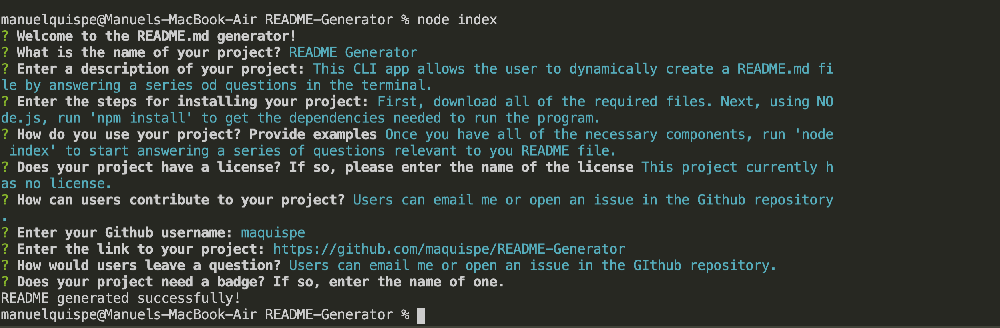
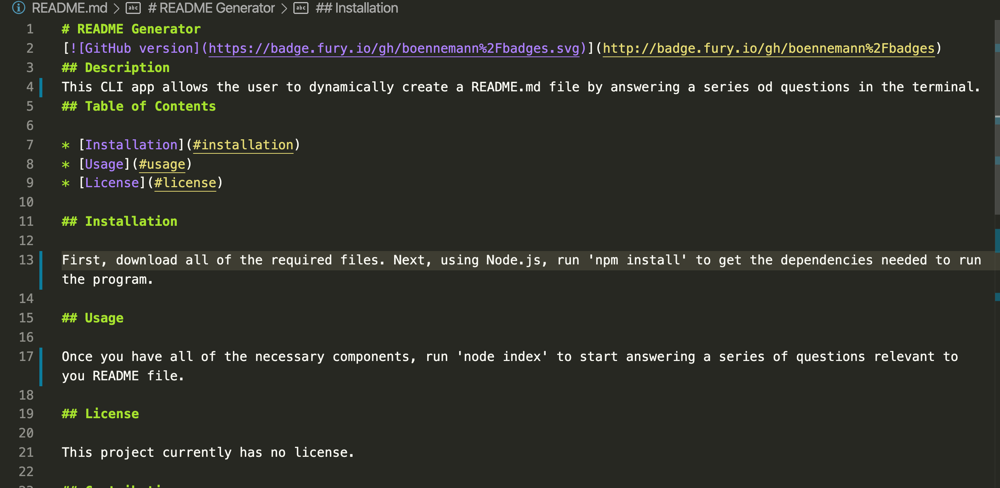

# README Generator

## Description
This CLI app allows the user to dynamically create a README.md file by answering a series od questions in the terminal.
## Table of Contents
    
* [Installation](#installation)
* [Usage](#usage)
* [License](#license)

## Installation

First, download all of the required files. Next, using Node.js, run 'npm install' to get the dependencies needed to run the program.

## Usage

Once you have all of the necessary components, run 'node index' to start answering a series of questions relevant to you README file.

## License

This project currently has no license.

## Contributing

Users can email me or open an issue in the Github repository.
* Email: elsadan96340@gmail.com
* Github username: maquispe
* Github repository link: https://github.com/maquispe/README-Generator
    
## Tests

## Questions

Users can email me or open an issue in the GIthub repository.
